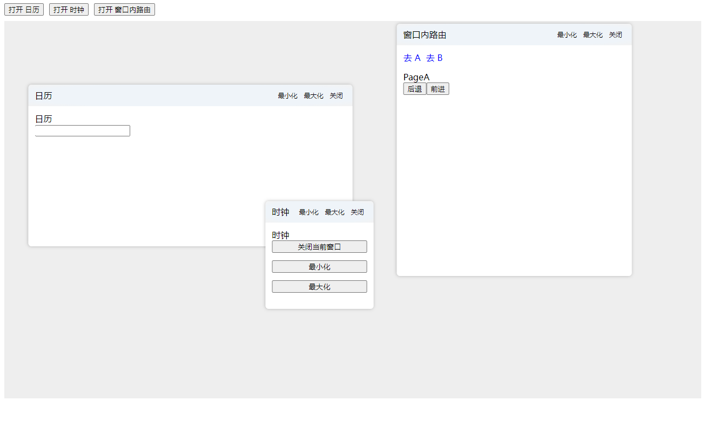

# 基于 React 的多窗口启动器，并在窗口中内置路由器



## 使用方式

## API

### `WindowLauncher`

容器组件  
引入此组件，注册要打开的窗口 `windowList`

```ts
const APP_LIST: WindowItem[] = [
  {
    title: '日历',
    key: 'calendar',
    size: {
      width: 600,
      height: 300,
      minWidth: 200,
      minHeight: 200,
    },
    component: <Calendar />,
  },
];
```

### `WindowContainer`

基于 react-rnd 封装的可拖动窗口容器

### `launcher`

窗口实例 `lib\launcher\Launcher.d.ts`  
可以进行所有窗口操作

### `useCurrentWindow`

hooks 可通过此 hook 直接管理当前窗口, 直接调用 API 中的方法，无需传入 ID

## Launcher API

```ts
/** 打开窗口 */
open(key: string, options?: WindowOptions): void;
/** 关闭窗口 */
close(id: string): void;
/** 最大化 */
maximize(id: string): void;
/** 最小化 */
minimize(id: string): void;
/** 正常化 */
normalize(id: string): void;
/** 设置尺寸 */
setSize(id: string, { width, height }: Pick<WindowSize, 'width' | 'height'>): {
    isUpdated: boolean;
    oldValue: OpenWindowItem | undefined;
    newValue: OpenWindowItem | undefined;
};
/** 设置位置 */
setPosition(id: string, { x, y }: {
    x: number;
    y: number;
}): {
    isUpdated: boolean;
    oldValue: OpenWindowItem | undefined;
    newValue: OpenWindowItem | undefined;
};
/** 更新窗口信息 */
updateOpenOptions(id: string, options: WindowOptions): {
    isUpdated: boolean;
    oldValue: OpenWindowItem | undefined;
    newValue: OpenWindowItem | undefined;
};
/** 获取窗口信息 */
getInfo(id: string): OpenWindowItem | undefined;
/** 至于顶层 */
toFront(id: string): void;
/** 至于底层 */
toBack(id: string): void;
/** 获取容器中心位置 */
getCenter(offsetX?: number, offsetY?: number): {
    x: number;
    y: number;
};
/** 获取当前路由 */
getRouter(id: string): Omit<IRoute, "component"> | undefined;
/** 设置当前路由 */
setRoute(id: string, route: Omit<IRoute, 'component'>): void;
/** 获取窗口自定义数据 */
getData(id: string): Record<string, any> | undefined;
/** 设置窗口自定义数据 */
setData(id: string, data: Record<string, any>): void;
/** 将打开的窗口转为 json */
toJSON(): string;
/** 将 json 导入 */
fromJSON(json: string): void;
```

## Router

### 使用方法

```jsx
import { LauncherRouter, Router } from 'react-window-launcher';

const routers = [
  {
    path: '/a',
    component: <PageA />,
  },
  {
    path: '/b',
    component: <PageB />,
  },
];

function App() {
  return <LauncherRouter routers={routers} />;
}
```

## Router API

```ts
// 跳转，生成新历史记录
push: (path: string, state?: RouteState) => void;
// 跳转，覆盖历史记录
replace: (path: string, state?: RouteState) => void;
// 后退
back: () => void;
// 前进
go: (index?: number) => void;
// 当前路由信息
getCurrent(): IRoute;
```
